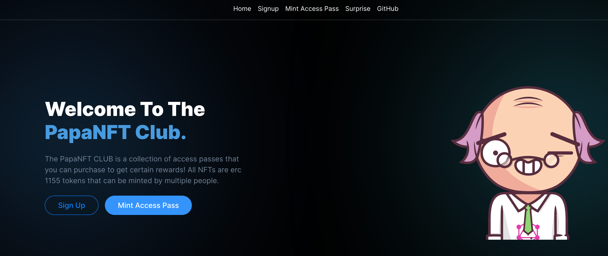
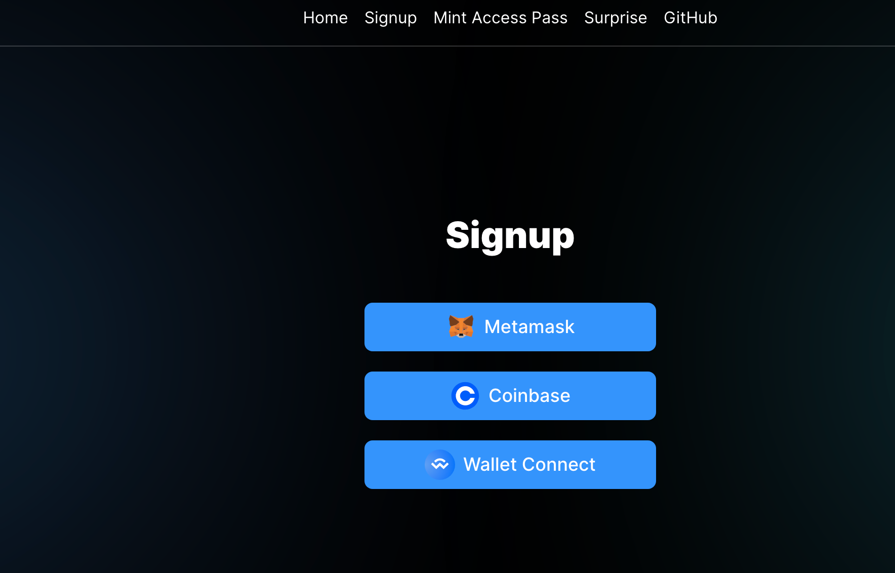
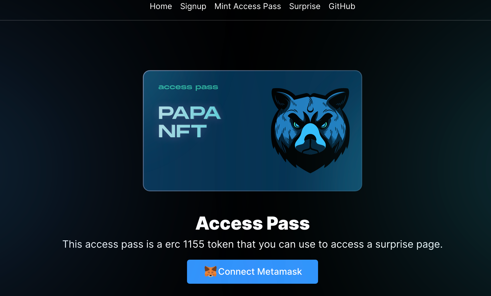
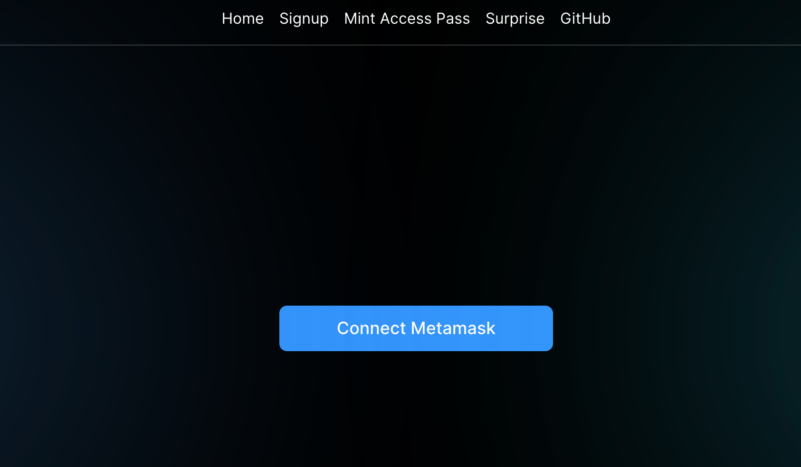

<div id="top"></div>

<!-- PROJECT LOGO -->
<br />
<div align="center">
  <a href="https://github.com/avneesh0612/PapaNFT">
    
  </a>

  <h3 align="center">PAPANFT</h3>

</div>

<!-- TABLE OF CONTENTS -->
<details>
  <summary>Table of Contents</summary>
  <ol>
    <li>
      <a href="#about-the-project">About The Project</a>
      <ul>
        <li><a href="#built-with">Built With</a></li>
      </ul>
    </li>
    <li><a href="#app-screenshots">License</a></li>
    <li><a href="#folder-structure">Contact</a></li>
    <li>
      <a href="#getting-started">Getting Started</a>
      <ul>
        <li><a href="#prerequisites">Prerequisites</a></li>
        <li><a href="#installation">Installation</a></li>
      </ul>
    </li>
    <li><a href="#usage">Usage</a></li>
    <li><a href="#roadmap">Roadmap</a></li>
    <li><a href="#contributing">Contributing</a></li>
    <li><a href="#license">License</a></li>
    <li><a href="#contact">Contact</a></li>

  </ol>
</details>

<!-- ABOUT THE PROJECT -->

## About The Project

[![Product Name Screen Shot][product]](https://papanft.vercel.app/)

Team Name: Team Mutants

- Idea: A website with an allowlist where users in the allowlist can mint an access pass by paying a fee, the app can be monetised. Now after minting the access pass NFT the user unlocks access to a secret surprise page.

- How does the user benefit: This creates an easier way to access content with crypto.

<p align="right">(<a href="#top">back to top</a>)</p>

### Built With

- [Next.js](https://nextjs.org/)
- [React.js](https://reactjs.org/)
- [Chakra UI](https://chakra-ui.com/)
- [Thirdweb](https://thirdweb.com/)


<p align="right">(<a href="#top">back to top</a>)</p>

<!-- App Screenshots -->
## App Screenshots

|                                    Home                                     |                                  Signup                                  |                                                                                      Mint Access Page                                                                                      |                                                                                          Surprise                                                                                          |
| :-------------------------------------------------------------------------: | :----------------------------------------------------------------------: | :----------------------------------------------------------------------------------------------------------------------------------------------------------------------------------------: | :----------------------------------------------------------------------------------------------------------------------------------------------------------------------------------------: |
|  |  |  |  |


<p align="right">(<a href="#top">back to top</a>)</p>

<!-- Folder Structure -->

## Folder Structure

    .
    ├── public/assets
    ├── src/                          
           |Layouts                 
           |components              
           |pages  
           |themes 
           |utils    
    ├── .gitignore
    └── README.md

<p align="right">(<a href="#top">back to top</a>)</p>

<!-- GETTING STARTED -->

## Getting Started

### Prerequisites


- yarn
  ```sh
  npm install --global yarn
  ```

### Installation


1. Clone the repo
   ```sh
   git clone https://github.com/avneesh0612/PapaNFT.git
   ```
2. Install packages
   ```sh
   yarn
   ```
3. Run Development Server
   ```js
   yarn run dev
   ```

<p align="right">(<a href="#top">back to top</a>)</p>

<!-- CONTRIBUTING -->

## Contributing

Contributions are what make the open source community such an amazing place to learn, inspire, and create. Any contributions you make are **greatly appreciated**.

If you have a suggestion that would make this better, please fork the repo and create a pull request. You can also simply open an issue with the tag "enhancement".
Don't forget to give the project a star! Thanks again!

1. Fork the Project
2. Create your Feature Branch (`git checkout -b feature/AmazingFeature`)
3. Commit your Changes (`git commit -m 'Add some AmazingFeature'`)
4. Push to the Branch (`git push origin feature/AmazingFeature`)
5. Open a Pull Request

<p align="right">(<a href="#top">back to top</a>)</p>

<!-- LICENSE -->

## License

Distributed under the MIT License.

<p align="right">(<a href="#top">back to top</a>)</p>

<!-- CONTACT -->

## Contact

PAPAFAM Team Mutants

* Avneesh Agarwal
* Ola Uthman
* Mohammed Aashik
* Arjun Joshi
* Karaz-debug 
* Ravi Rajyaguru

<p align="right">(<a href="#top">back to top</a>)</p>


<!-- MARKDOWN LINKS & IMAGES -->
<!-- https://www.markdownguide.org/basic-syntax/#reference-style-links -->

[product-screenshot]: images/screenshot.png
[logo]: public/assets/logo.svg
[product]: public/assets/og.png
